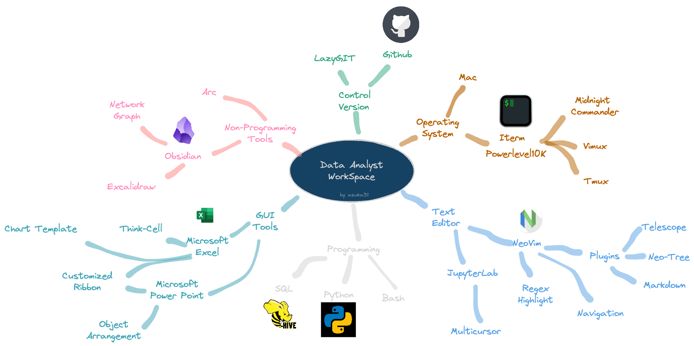

```python
condition = 'World is still facing many issues'
while 'issues' in condition:
  print('Do the the best for better world')
  try:
    totalhours = 24
    habbit = 'lying on the bed while watching social media to see other\'s life'
    is = habbit * totalhours
  else:
    raise ValueError('It will never solve, then what?')
  finally:
    print('Get back to your laptop and fix your code')
```


## :sunglasses: Profile

- :computer: Working with remarkable team **Advanced Analytics and Growth Marketing, Telkomsel**
- :chart_with_downwards_trend: Now, I've been learning **Advanced Statistics, Python, Machine Learning, and Deep Learning**
- :grey_question: Ask me about **Data Issues, Finding Insights, Problem Solving using Python**
- :email: How to reach me **azkarohbiya@gmail.com**
- :runner: Daily Activity **Learning, Coding, and Physical Exercise**


## :newspaper: Latest Medium Blogs

- [Python Date and Time I’ve Found Very Useful and Frequently Used as a Data Analyst](https://python.plainenglish.io/python-date-and-time-ive-found-very-useful-and-frequently-used-as-data-analyst-556122a4da99)
- [How to Solve the BotClean Challenge from AI Hackerrank Challenges](https://python.plainenglish.io/breaking-ai-hackerrank-challenges-bot-clean-1ec7f7204fca)

## :computer: Technical Skills

| Key Aspects | Tools |
|-------------|-------|
Programming languages|   |
| Data Processing Tools           |                                                                                                                                                                             |
| Big Data Framework              |                                                                                                                                                                                                                                                                                |
| Statistics and Machine Learning |                                                                                                                   |
| Data Visualization              |    
| Computational Science           |                                                                                                                                                                                                                                                                                                        |
| Work Space                      |   

## :school: Bootcamp Adventures

| Bootcamp   | Click Below to Find More                                         |
|------------|------------------------------------------------------------------|
| Datacamp   | [Datacamp Profile](https://www.datacamp.com/profile/azkarohbiya) |
| Hackerrank | [Hackerrank Profile](https://www.hackerrank.com/azkarohbiya)     |
| SoloLearn  | [SoloLearn Profile](https://www.sololearn.com/profile/21910164)  |

*Containing Courses, Projects, and Career Tracks*

# :rocket: My Workspace

I’m super excited to share my workspace journey because it can seriously boost your productivity by a hundred times! Let me tell you why I dove into this whole learning process early in my career as a data analyst. I realized there were so many time-consuming tasks that just drained my energy—like debugging code, cleaning up data, digging through piles of files to find hidden info, editing multiple documents, and more.

Once I switched up my workflow, it completely transformed my productivity. I was able to cut out all those overwhelming processes and start focusing on the strategic areas that really make a difference for my company.




If you are interested in to learn my setting, I'm so glad to share with you by just click my special repository here 
[AzukaWorkspace](https://github.com/azuka31/AzukaWorkspace/tree/master)


